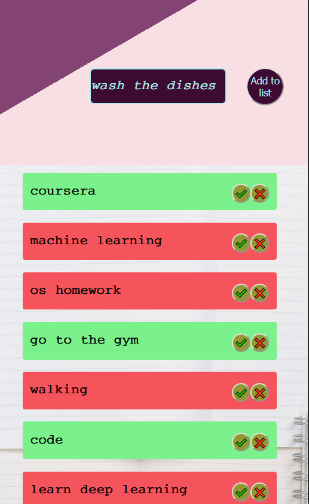

# My first project with React

This project is a to-do list.
You can type your plan and check it when you're done.
If you make a mistake, don't worry  click check again or click cross.
It's responsive and I used html, css, js and react to build it.

## For cellphone

